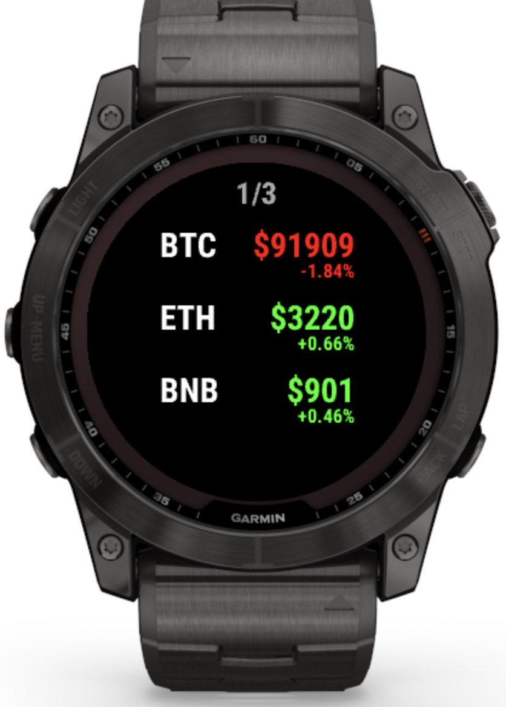
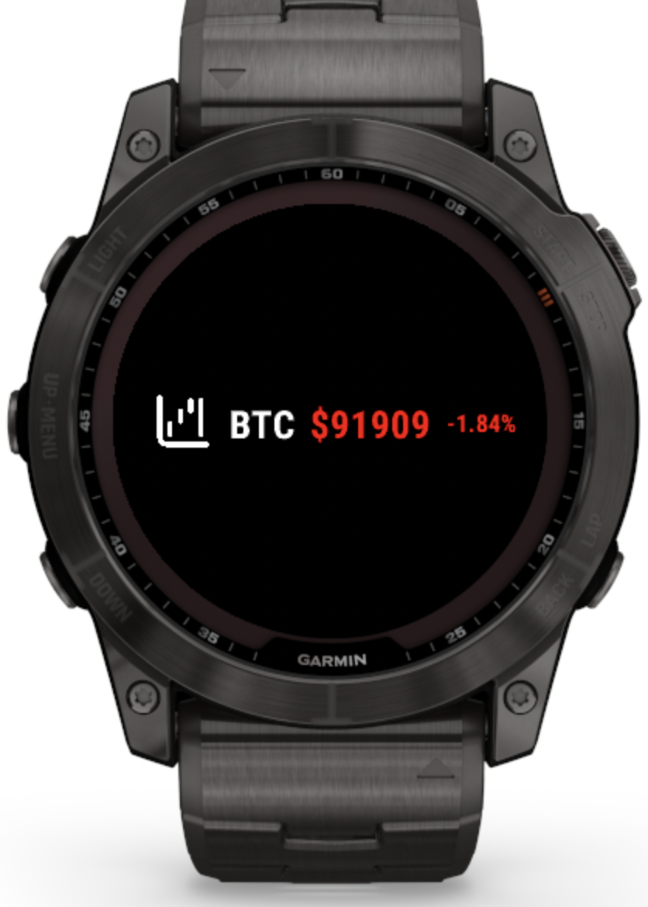

# CryptoPrice - Garmin Watch Widget

A real-time cryptocurrency price tracker for Garmin smartwatches. Monitor your favorite crypto assets directly from your wrist with live prices, 24-hour changes, and glance view support.

<p align="center">
  
  
</p>

*Left: Main widget view showing multiple cryptocurrencies with prices and 24h changes | Right: Glance view for quick price checks*

## Features

- **Real-Time Price Updates** - Track live cryptocurrency prices using Binance API
- **Multiple Cryptocurrencies** - Monitor crypto assets with paginated view (3 per page)
- **24-Hour Price Changes** - View percentage changes with color-coded indicators (green for gains, red for losses)
- **Glance View Support** - Quick price check from your watch face without opening the app
- **Background Updates** - Automatic price refreshes every 60 minutes. Manually each time the app is opened
- **Add/Remove Cryptos** - Easily manage your crypto portfolio from the watch
- **No API Key Required** - Uses public Binance API endpoints

## Supported Cryptocurrencies

The widget validates symbols against Binance's USDT trading pairs. Popular cryptocurrencies include:
- Bitcoin (BTC)
- Ethereum (ETH)
- Binance Coin (BNB)
- Solana (SOL)
- Cardano (ADA)
- Ripple (XRP)
- And many more...

## Compatible Devices

This widget supports a wide range of Garmin devices including:

### Fenix Series
- Fenix 6, 6S, 6 Pro, 6S Pro, 6X Pro
- Fenix 7, 7S, 7X (including Pro and Pro No WiFi variants)
- Fenix 8 (43mm, 47mm, Solar 47mm, Solar 51mm)
- Fenix Chronos, Fenix E

### Forerunner Series
- Forerunner 165, 165M
- Forerunner 245, 245M
- Forerunner 255, 255M, 255S, 255S Music
- Forerunner 265, 265S
- Forerunner 570 (42mm, 47mm)
- Forerunner 745
- Forerunner 945, 945 LTE
- Forerunner 955, 965, 970

### Epix Series
- Epix 2, Epix 2 Pro (42mm, 47mm, 51mm)

### Venu Series
- Venu 2, 2 Plus, 2S
- Venu 3, 3S
- Venu Sq 2, Sq 2 Music
- Venu X1

### Approach Series
- Approach S50
- Approach S70 (42mm, 47mm)

### D2 Series
- D2 Air X10
- D2 Mach 1

### Edge Series
- Edge 540, 840
- Edge 1040, 1050
- Edge Explore 2

### Enduro Series
- Enduro, Enduro 3

### Instinct Series
- Instinct 3 AMOLED (45mm, 50mm)

### MARQ Series
- MARQ 2, MARQ 2 Aviator
- MARQ Adventurer, Athlete, Aviator, Captain, Commander, Driver, Expedition, Golfer

### Vívoactive Series
- Vívoactive 5, 6

## Installation

### From Garmin Connect IQ Store
*Coming soon!* The widget is currently under development and will be published to the Connect IQ Store.

### Manual Installation (Development)
For now, you can install manually by building from source:
1. Clone this repository
```bash
git clone https://github.com/yourusername/CryptoPrice.git
cd CryptoPrice
```

2. Install [Connect IQ SDK](https://developer.garmin.com/connect-iq/sdk/)

3. Build and deploy using Visual Studio Code with the Connect IQ extension:
   - Open the project in VS Code
   - Select your target device
   - Run "Monkey C: Build for Device"
   - Deploy to your watch or simulator

## Usage

### Adding a Cryptocurrency
1. Open the widget
2. Press MENU button
3. Select "Add Crypto"
4. Enter the symbol (e.g., BTC, ETH, SOL)
5. The widget will validate and add the crypto if available

### Removing a Cryptocurrency
1. Open the widget
2. Press MENU button
3. Select "Remove Crypto"
4. Enter the symbol (e.g., BTC, ETH, SOL)

### Refreshing Prices
- Prices automatically refresh when you open the app
- Background updates occur every 60 minutes

### Glance View
Add the widget to your glance loop to see the first cryptocurrency in your portfolio at a glance with color-coded price changes. The first symbol from your list is displayed in the glance view.

## Technical Details

### Architecture
- **Language**: Monkey C (Connect IQ SDK)
- **API**: Binance Public API (no authentication required)
- **Data Storage**: Local device storage using Connect IQ Storage API
- **Update Frequency**: Manual refresh + automatic background updates every 60 minutes
- **Permissions**: Communications, Background

### API Endpoints
- Price Data: `https://api.binance.com/api/v3/ticker/24hr`
- Trading Pairs: USDT base (e.g., BTCUSDT, ETHUSDT)

### Rate Limiting
- Implements request throttling to prevent API rate limit issues
- Minimum 1-second interval between requests
- Batches multiple crypto updates into single API calls

## Development

### Project Structure
```
CryptoPrice/
├── source/
│   ├── models/
│   │   ├── CryptoCurrency.mc       # Crypto data model
│   │   └── CryptoPortfolio.mc      # Portfolio management
│   ├── CryptoConfig.mc              # Configuration constants
│   ├── CryptoDataManager.mc         # API communication
│   ├── CryptoPriceApp.mc            # App entry point
│   ├── CryptoPriceView.mc           # Main view
│   ├── CryptoPriceGlanceView.mc     # Glance view
│   ├── CryptoBackgroundServiceDelegate.mc  # Background updates
│   ├── AddCryptoDelegate.mc         # Add crypto handler
│   ├── RemoveCryptoDelegate.mc      # Remove crypto handler
│   └── ...
├── resources/
│   ├── drawables/                   # Icons and images
│   ├── layouts/                     # UI layouts
│   └── strings/                     # Text strings
├── manifest.xml                     # App manifest
└── monkey.jungle                    # Build configuration
```

### Building from Source
```bash
# Ensure Connect IQ SDK is installed and configured
# Build for specific device
monkeyc -d fenix7 -f monkey.jungle -o bin/CryptoPrice.prg -y developer_key

# Or use VS Code with Connect IQ extension
```

## Contributing

Contributions are welcome! Here's how you can help:

1. Fork the repository
2. Create a feature branch (`git checkout -b feature/amazing-feature`)
3. Commit your changes (`git commit -m 'Add amazing feature'`)
4. Push to the branch (`git push origin feature/amazing-feature`)
5. Open a Pull Request

### Areas for Contribution
- Additional cryptocurrency exchange support (Coinbase, Kraken, etc.)
- More customization options (colors, refresh intervals)
- Additional data points (volume, market cap, etc.)
- Localization (translations)
- Bug fixes and optimizations

## License

This project is open source and available under the [GNU General Public License](LICENSE).

## Acknowledgments

- Price data provided by [Binance API](https://binance-docs.github.io/apidocs/spot/en/)
- Built with [Garmin Connect IQ SDK](https://developer.garmin.com/connect-iq/)

## Support

If you encounter any issues or have questions:
- Open an issue on [GitHub](https://github.com/yourusername/CryptoPrice/issues)

## Disclaimer

This widget is for informational purposes only. Cryptocurrency prices are provided by third-party APIs and may not be 100% accurate. Always verify prices on official exchanges before making trading decisions. This is not financial advice.

---

Made with ❤️ for the Garmin and crypto community
